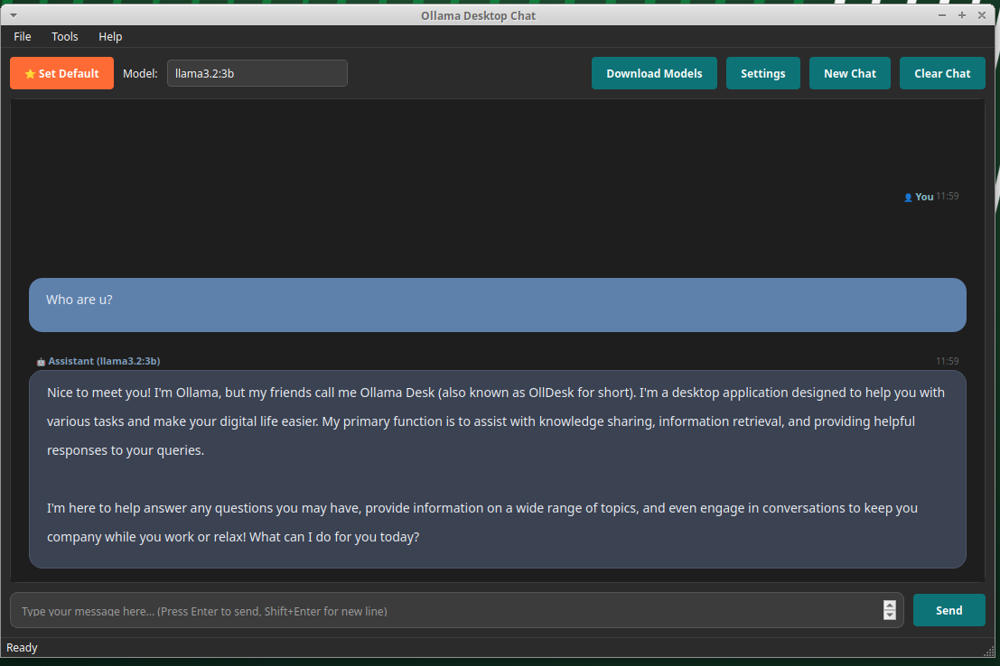

 # Ollama Desktop Chat




A modern desktop chat application for Ollama AI models built with PySide6.

## Features

- **Rich Chat Interface**: Beautiful dark theme with message bubbles and timestamps
- **Markdown Support**: Full markdown rendering with syntax highlighting for code blocks
- **Model Management**: Easy model selection, filtering, and downloading
- **Real-time Streaming**: Live responses from Ollama models
- **No-scroll Messages**: Messages expand to full height with main area scrolling only
- **Modern UI**: Responsive design with professional styling

## Quick Start

1. **Install Dependencies**:
   ```bash
   pip install -r requirements.txt
   ```

2. **Start Ollama Server** (if not running):
   ```bash
   ollama serve
   ```

3. **Run Application**:
   ```bash
   python run.py
   ```

## Project Structure

```
├── run.py              # Application launcher
├── app.py              # Main application setup
├── main_window.py      # Primary UI window
├── models.py           # Data models
├── workers.py          # Background threads
├── ui_components.py    # Custom UI widgets
├── dialogs.py          # Settings/download dialogs
├── rich_content.py     # Markdown rendering
└── requirements.txt    # Dependencies
```

## Usage

- Select a model from the dropdown
- Type messages in the input box
- Press Enter to send (Shift+Enter for new lines)
- Use "Download Models" to add new models
- Access settings via the Settings button

## Requirements

- Python 3.8+
- PySide6
- Ollama server running locally or remotely
- At least one Ollama model installed

## License

MIT License
- **Chat Sessions**: Framework for saving and loading chat sessions
- **Keyboard Shortcuts**: Ctrl+Enter to send, Ctrl+N for new chat, Ctrl+, for settings
- **Auto-scrolling**: Automatic scroll to latest messages with toggle option

### 🎛️ Model Configuration
- **Temperature Control**: Adjustable creativity/randomness (0.0-2.0)
- **Top-P Sampling**: Nucleus sampling parameter control
- **Context Window**: Configurable context length (512-32768 tokens)
- **Max Tokens**: Response length limiting
- **System Prompts**: Custom system message support
- **Generation Options**: Advanced parameter fine-tuning

## 🛠️ Requirements

- **Python**: 3.9 or higher
- **Ollama**: Must be running locally (configurable host/port)
- **Operating System**: Linux, Windows, or macOS
- **Memory**: Recommended 4GB+ RAM for larger models

## 📦 Installation

### 1. Clone or Download
```bash
git clone <repository> # or download the files
cd Ollama
```

### 2. Create Virtual Environment
```bash
python3 -m venv .venv
source .venv/bin/activate  # On Windows: .venv\\Scripts\\activate
```

### 3. Install Dependencies
```bash
pip install -r requirements.txt
```

### 4. Ensure Ollama is Running
Make sure Ollama is installed and running:
```bash
ollama serve  # Start Ollama server
ollama list   # Check available models
```

## 🗑️ Uninstallation

### Automatic Uninstallation (If installed via install.sh)
```bash
# Run the uninstall script
~/.local/share/OllamaDesktop/uninstall.sh
```

### Manual Uninstallation
```bash
# Stop the application
pkill -f "OllamaDesktop"

# Remove application files
rm -rf ~/.local/share/OllamaDesktop

# Remove desktop entry
rm -f ~/.local/share/applications/OllamaDesktop.desktop

# Remove settings (optional)
rm -rf ~/.config/OllamaDesktop
rm -f ~/.config/OllamaDesktop.conf

# Update desktop database
update-desktop-database ~/.local/share/applications
```

## 🚀 Usage

### Starting the Application
```bash
# Method 1: Using the launcher script (recommended)
python run.py

# Method 2: Using the new modular entry point
python app.py

# Method 3: Using the compatibility layer
python ollama_desktop.py

# Method 4: VS Code task (if available)
# Run "Run Ollama Desktop" task from the command palette
```

### Basic Usage
1. **Configure API** (if needed): Go to Settings → API Settings
2. **Download Models**: Click "Download Models" to get latest optimized models
3. **Select a Model**: Choose from available models in the left sidebar
4. **Type Message**: Enter your message in the input area at the bottom
5. **Send**: Click "Send" or press Ctrl+Enter
6. **View Response**: Watch the AI respond in real-time with streaming text

### Available Models for Download
- **Llama 3.2 1B** (1.3GB) - Ultra-efficient latest model
- **Llama 3.2 3B** (2.0GB) - Balanced performance and size
- **Llama 3.2 Latest** (4.7GB) - Full-featured model
- **Mistral 7B** (4.1GB) - High-quality instruct model
- **Code Llama 7B** (3.8GB) - Specialized for programming
- **Phi-3 Mini** (2.3GB) - Microsoft's efficient model
- **Gemma 2 2B** (1.6GB) - Google's lightweight model
- **Qwen2.5 1.5B** (0.9GB) - Multilingual capabilities
- **DeepSeek Coder** (0.7GB) - Specialized coding model
- **TinyLlama** (0.6GB) - Ultra-lightweight for testing
- **More ...

## 🎛️ Configuration

### API Settings
- **Host**: Ollama server hostname (default: localhost)
- **Port**: Ollama server port (default: 11434)
- **Timeout**: Request timeout in seconds (default: 30)
- **Connection Test**: Built-in connectivity testing

### Model Parameters
- **Temperature**: Controls randomness (0.0 = deterministic, 2.0 = very creative)
- **Top-P**: Nucleus sampling threshold (0.1-1.0)
- **Max Tokens**: Maximum response length (1-8192)
- **Context Window**: Model context size (512-32768)
- **System Prompt**: Custom system instructions

### Interface Options
- **Dark Mode**: Toggle dark/light theme
- **Auto-scroll**: Automatic scrolling to new messages
- **Show Timestamps**: Display message timestamps
- **Font Size**: Adjustable text size (8-24pt)

## 🏗️ Architecture

### Core Components
- **Main Window** (`OllamaDesktopApp`): Central application controller
- **Chat Widget** (`ChatMessageWidget`): Individual message display with rich formatting
- **Worker Threads**: 
  - `OllamaWorker`: API communication and streaming
  - `ModelManager`: Model operations and downloads
- **Dialogs**:
  - `SettingsDialog`: Comprehensive configuration interface
  - `ModelDownloadDialog`: Model selection and download management

### Key Features
- **Asynchronous Operations**: All API calls and downloads are non-blocking
- **Memory Management**: Efficient message handling with cleanup
- **Error Recovery**: Robust error handling with user feedback
- **Settings Persistence**: Automatic saving/loading of all configurations
- **Extensible Design**: Modular architecture for easy feature additions

## 🔧 Troubleshooting

### Common Issues

**Import/Dependency Errors**
```bash
# Ensure virtual environment is activated
source .venv/bin/activate
pip install -r requirements.txt
```

**Ollama Connection Issues**
```bash
# Test connection manually
curl http://localhost:11434/api/tags

# Check if Ollama is running
ps aux | grep ollama

# Start Ollama if needed
ollama serve
```

**Model Download Failures**
- Check internet connection
- Verify Ollama server is running
- Ensure sufficient disk space
- Try downloading smaller models first

**Performance Issues**
- Use smaller models (1B-3B parameters) for faster responses
- Reduce context window size for memory efficiency
- Lower temperature for more focused responses
- Clear chat history for long conversations

### API Configuration
- **Remote Ollama**: Configure custom host/port for remote Ollama instances
- **Timeout Settings**: Increase timeout for slower connections or large models
- **Connection Testing**: Use built-in test feature to verify connectivity

## 🛠️ Development

### Modular Benefits

The new modular architecture provides several advantages:

- **Maintainability**: Clear separation of concerns across modules
- **Testability**: Individual components can be tested in isolation  
- **Extensibility**: Easy to add new features without affecting existing code
- **Code Reuse**: UI components and workers can be reused across the application
- **Type Safety**: Proper type hints and data models for better IDE support

### Adding New Features

1. **Data Models**: Add new structures to `models.py`
2. **Background Operations**: Implement workers in `workers.py`
3. **UI Components**: Create reusable widgets in `ui_components.py`
4. **Dialogs**: Add new dialogs to `dialogs.py`
5. **Main Logic**: Extend functionality in `main_window.py`

### Code Guidelines

- Follow PEP 8 conventions for Python code style
- Use type hints for all function parameters and return values
- Document classes and methods with clear docstrings
- Separate UI logic from business logic
- Use Qt signals/slots for thread-safe communication
- Keep modules focused on single responsibilities

### Testing the Application

```bash
# Quick syntax check
python -m py_compile *.py

# Run the modular version
python app.py

# Test individual modules (if needed)
python -c "import models; print('Models OK')"
python -c "import workers; print('Workers OK')"
python -c "import ui_components; print('UI Components OK')"
```

## 📄 License

MIT License - Feel free to use, modify, and distribute.

## 🤝 Contributing

Contributions are welcome! Areas for improvement:
- Additional model providers (OpenAI, Anthropic integration)
- Chat session persistence and management
- Advanced prompt templates
- Model fine-tuning interface
- Performance monitoring and analytics
- Mobile/web companion apps

## 🔗 Related Projects

- [Ollama](https://ollama.ai/) - Local AI model runtime
- [PySide6](https://doc.qt.io/qtforpython/) - Python GUI framework
- [Ollama Python](https://github.com/ollama/ollama-python) - Official Python client

## 🎯 Roadmap

### Upcoming Features
- **Chat Export**: Save conversations in multiple formats
- **Model Comparison**: Side-by-side model testing
- **Advanced Prompting**: Template system and prompt engineering tools
- **Performance Analytics**: Response time and token usage tracking
- **Cloud Integration**: Optional cloud model support
- **Plugin Architecture**: Custom extensions and integrations

---

**Experience the power of local AI with a professional, feature-rich interface!** 🤖✨

*Built with ❤️ using PySide6 and the Ollama ecosystem*
